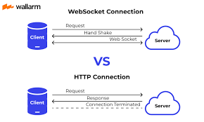
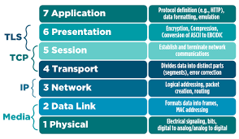
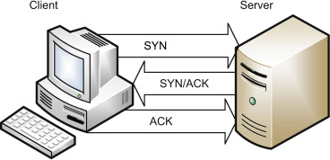

## Web Socket

What is a Web Socket?

- A Web Socket is a communication protocol that provides full-duplex communication channels over a single TCP connection. It enables real-time, bidirectional communication between a client and a server, allowing them to exchange data without the need for continuous HTTP requests.

Describe the Web Socket request/response handshake and what happens once the connection is established.

- The Web Socket request/response handshake involves the following steps:
- The client sends a special HTTP request, called an "upgrade request," to the server, indicating its desire to establish a Web Socket connection.
- The server checks if it supports the Web Socket protocol and if the requested URL is valid. If so, it sends a successful HTTP response, called an "upgrade response," to the client.
- Once the connection is upgraded, both the client and server can exchange data using the Web Socket protocol.
- Once the connection is established, the client and server can send messages to each other in real-time. The messages are framed and sent over the TCP connection, allowing for efficient and low-latency communication.
- Web Sockets provide a standardized way for the server to send content to a client without first receiving a ____ from that client.

Web Sockets provide a standardized way for the server to send content to a client without first receiving a request from that client.
What does the event handler io.on() do?

- The event handler io.on() in Socket.io is used to listen for incoming events from clients. It allows the server to handle various events triggered by the client, such as connecting, disconnecting, or custom events defined by the application. For example, io.on('connection', callback) is used to handle the event when a client connects to the server.
Describe some possible proof of life or proof that the code works as expected in a Socket.io application.

- Possible proof of life or proof that the code works as expected in Socket.io can include:
- Displaying a message on the server console when a client successfully connects or disconnects.
- Emitting a custom event from the client and receiving it on the server side.
- Broadcasting a message from the server to all connected clients and verifying that the clients receive it.

What does socket.emit() do?

- socket.emit() is used in Socket.io to send a custom event from the client to the server or from the server to a specific client. It allows for the exchange of data or triggering of actions based on these events. The emit() function takes the event name as the first parameter and the data to be sent as the second parameter.

What is the difference between WebSocket and Socket.IO? (think Git and GitHub, or OAuth and Auth0)

- WebSocket is a communication protocol that provides a standardized way for real-time, bidirectional communication between a client and a server. It operates at the TCP layer and provides a low-level API for direct interaction with the WebSocket protocol.
- Socket.IO, on the other hand, is a library that abstracts the WebSocket protocol and provides additional features, such as fallback mechanisms for older browsers, support for different transport protocols (WebSocket, AJAX long polling, etc.), and event-based communication. Socket.IO builds on top of WebSocket and provides a higher-level API for easier implementation of real-time applications.
- In analogy, WebSocket can be compared to Git, which is a version control system, while Socket.IO is like GitHub, which provides additional features and services built on top of Git.

When would you use Socket.IO?

- Socket.IO is typically used when you need real-time, bidirectional communication between the client and server. It is suitable for applications that require instant updates, such as chat applications, collaborative editing tools, real-time gaming, or real-time monitoring systems. Socket.IO's fallback mechanisms also make it useful for supporting older browsers that may not have native WebSocket support.

When would you use WebSockets?

- WebSockets are used when you specifically need a low-level, raw WebSocket connection without the additional features provided by Socket.IO. If your application only requires basic real-time communication and you prefer a more lightweight solution, using WebSocket directly can be a good choice.

### OSI model

The OSI Model is a conceptual framework consisting of seven layers that standardize the functions of a communication system. The layers, from bottom to top, are Physical, Data Link, Network, Transport, Session, Presentation, and Application. Each layer has specific responsibilities and interacts with adjacent layers to facilitate data flow. The model promotes modularity and interoperability between network devices and technologies. It provides a common reference for understanding and troubleshooting network communication issues. Real-world protocols may not strictly adhere to the exact layering, but the OSI Model remains a valuable tool for comprehending network concepts and protocols.

### TCP Handshakes
TCP Handshakes are a polite introduction between devices before they communicate over the internet. It involves a three-step process: the client sends a "hello" message, the server responds with an acknowledgment, and the client confirms the acknowledgment. Once this handshake is complete, a reliable connection is established for smooth communication.

